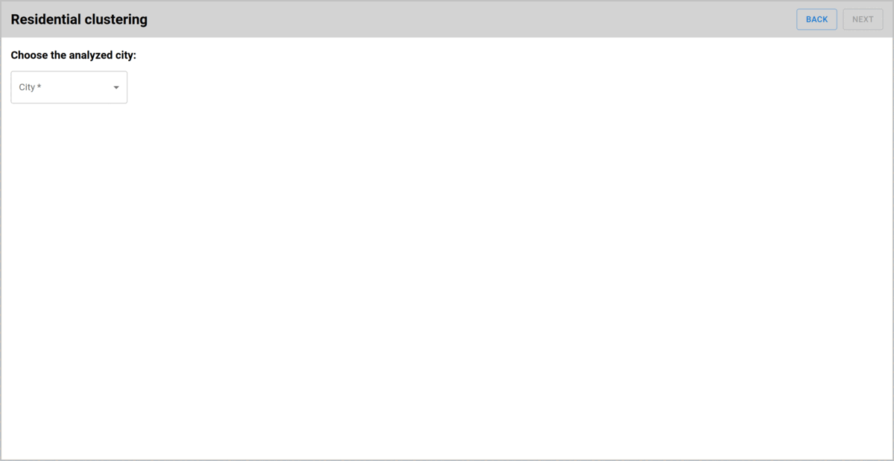
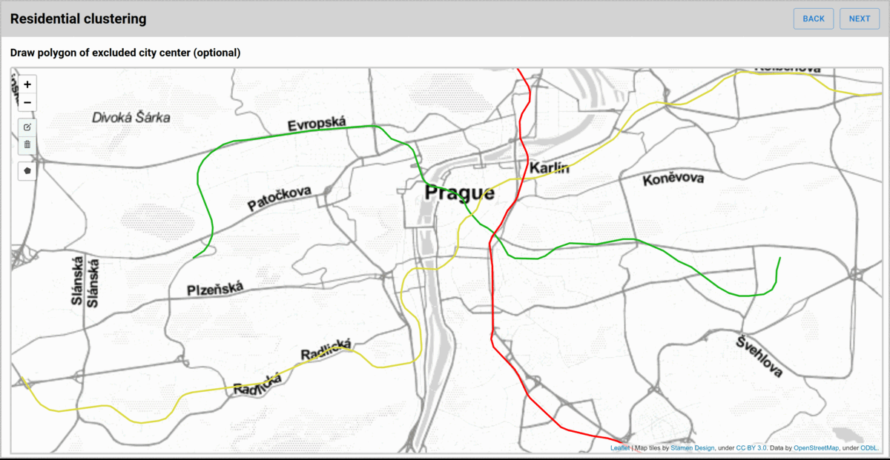
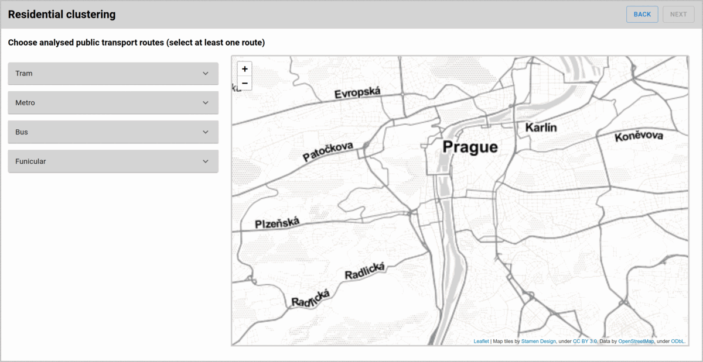
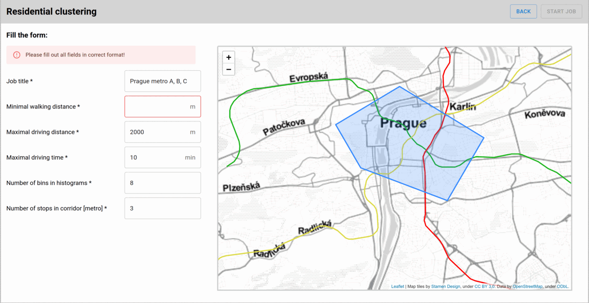
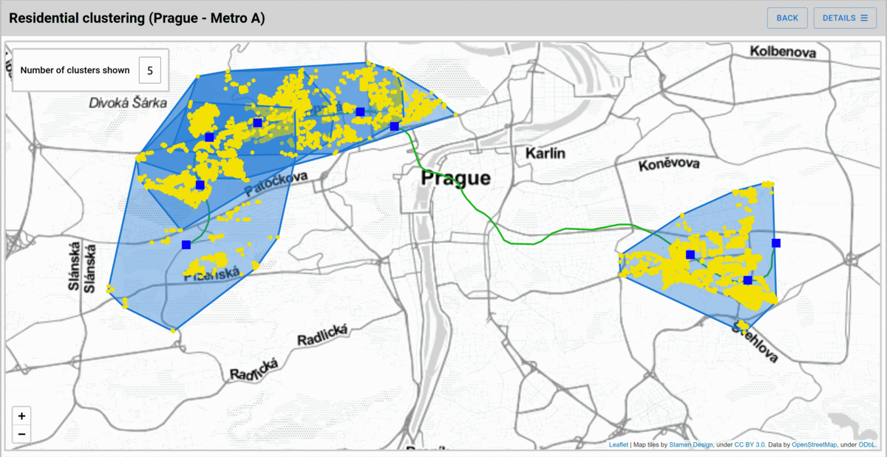
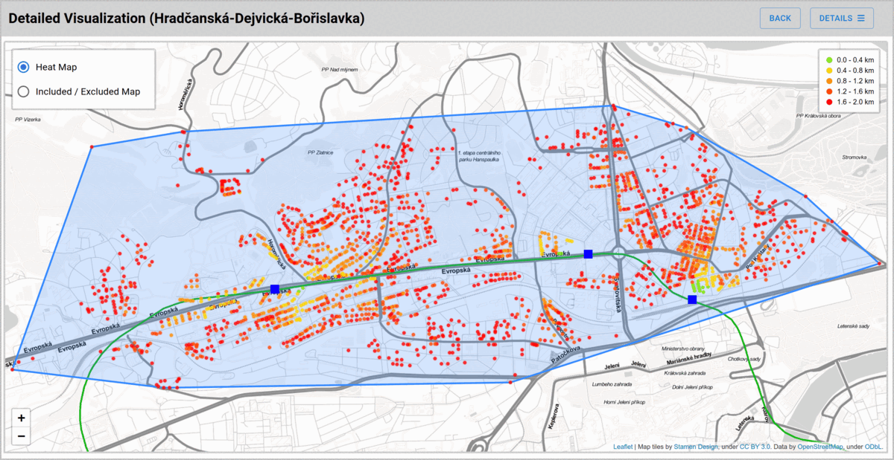

# Optimal residential clusters quantification and visualization web application

Description: An interactive web application for creating clustering analysis jobs and visualizing the results in a map. This application was the assignment of my bachelor thesis and the idea came from the company Mileus, which had an API for running the clustering analysis itself. 

Technology used:

    • React.js – for creating the application user interface
    • Leaflet – for creating map components
    • Recharts – for visualizing statistical data
    • Material UI – for component styles
    • GeoJSON – data format for transfering geospacial data
    • Flask – for the rest api
    • Python libraries: numpy, pandas, shapely and gtfsk
    • MongoDB

# Screenshots

# Install manual
This application is tested on the 16.14.0 version of Node.js

1. Install node.js https://nodejs.org/en/download/
2. Install the node packages `npm install`
3. Run the application `npm run`

# Rest API 
The Rest API for this application is located here: https://github.com/atestee/residentialclustering-server
